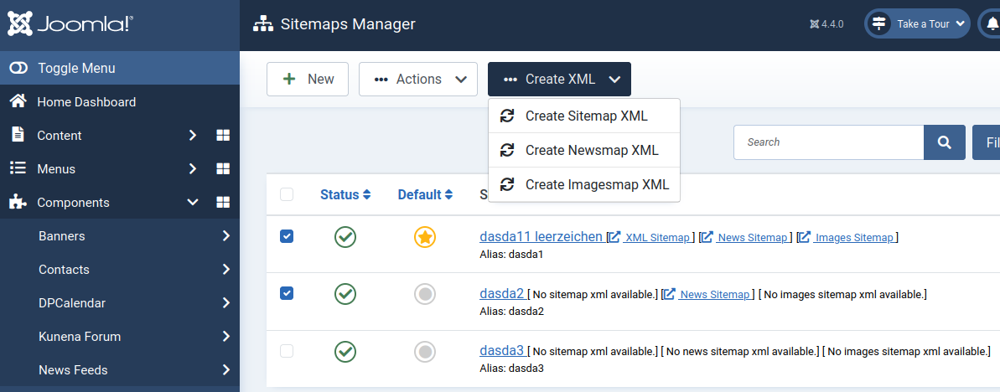

# XML Sitemap
Since SchuWeb Sitemap version 5 and newer the XML version of the sitemaps where generated as real XML files. This means that you don't have anymore a huge URL with a lot characters and no additional server load on every call of the XML sitemap. Instead SchuWeb Sitemap generates XML sitemap and stores it to your Joomla! root directory. 

## Generation
To generate the XML files of the sitemap you need to go to the backend of SchuWeb Sitemap. Choose the sitemaps you want to generate the xml file for

If a XML file is available, the URL is shown beside the name of the sitemap in the table. If no XML file is available a text ist shown "No xyz sitemap xml available".

## Update
To update an XML sitemap file, you need to redo the generation step explained above.

It is planed to support Joomla! Tasks from version 5.1 on.

## Naming
The names for the default sitemap are `sitemap.xml` for the standard sitemap, `sitemap_news.xml` for the news sitemap and `sitemap_images.xml` for the images sitemap.

For every additional sitemap the name you have defined in the backend ist used as file names in the same structure `<YOUNAME>.xml`, `<YOUNAME>_news.xml` and `<YOUNAME>_images.xml`.